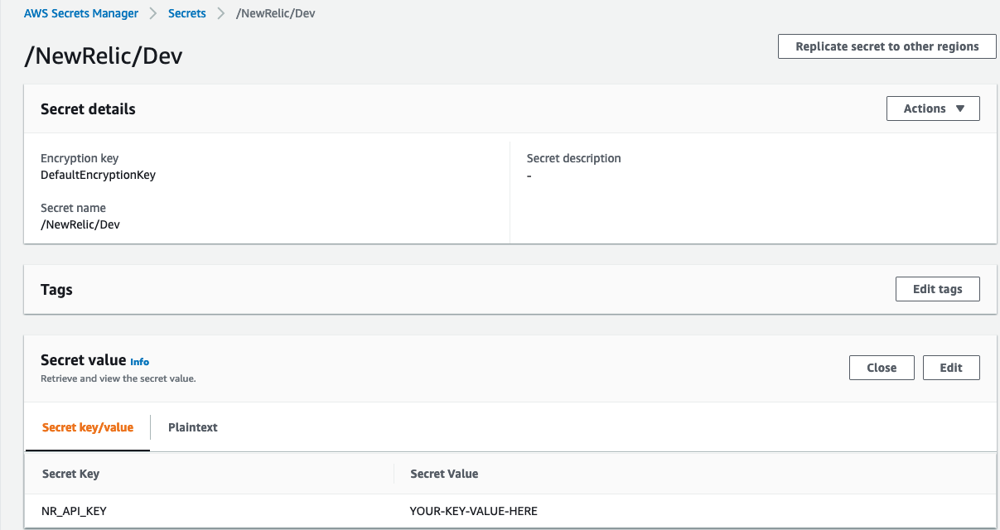

# Imperva NEL

This project deploys [Network Error Logging (NEL)](https://www.w3.org/TR/network-error-logging) via terraform configuring Imperva's Cloud WAF, and standing up several AWS resources, including: Lambda functions, API Gateway API, Kinesis Stream, S3, Firehose, IAM Policies, and Secret Manager.  You can update the template to add AWS resources through the same deployment process that updates your application code.

## Prerequisites and Dependencies
- Install [AWS CLI](https://aws.amazon.com/cli/)
- Install [Terraform](https://www.terraform.io/) 
- Create a valid [New Relic API Key](https://docs.newrelic.com/docs/apis/get-started/intro-apis/new-relic-api-keys/)
- Create a sercet store in [AWS Secrets Mananger](https://docs.aws.amazon.com/secretsmanager/latest/userguide/intro.html) with key as `NR_API_KEY` as shown below, inserting your valid New Relic API Key (created above in previous step).

     

## Setup up the environment
- Copy and rename the `terraform.tfvars.template` file to `terraform.tfvars`, and set the following parameters:

    `aws_region` - _(required)_ the aws region to deploy in, example: `us-east-2`

    `secret_store_name` - _(required)_ the name of the secret store, example: `/NewRelic/Dev`

    `site_id` - _(required)_ an array of Cloud WAF site ids to deploy NEL on, example: `["12345","67890"]`

    `account_id` - _(required)_ the id of the account or sub account, example: `1234`

    `aws_resource_prefix` - _(required)_ a string value to prefix all resources created via Terraform in AWS, example: "nel-dev"

    `bucket_name` - _(required)_ the globally unique name of your S3 bucket in AWS, example: "your-unique-domain.here.com"

    `api_id` - _(required)_ the Cloud WAF api user api id, example: `12345`

    `api_key` - _(required)_ the Cloud WAF api user secret key, example: `AbCdE-12345-defgh-67890`

## Deploying the environment
- In the `nel-aws-for-new-relic` folder, run the following commands to initialize and deploy:  
    - `terraform init`
    - `terraform plan`
    - `terraform apply --auto-approve`
